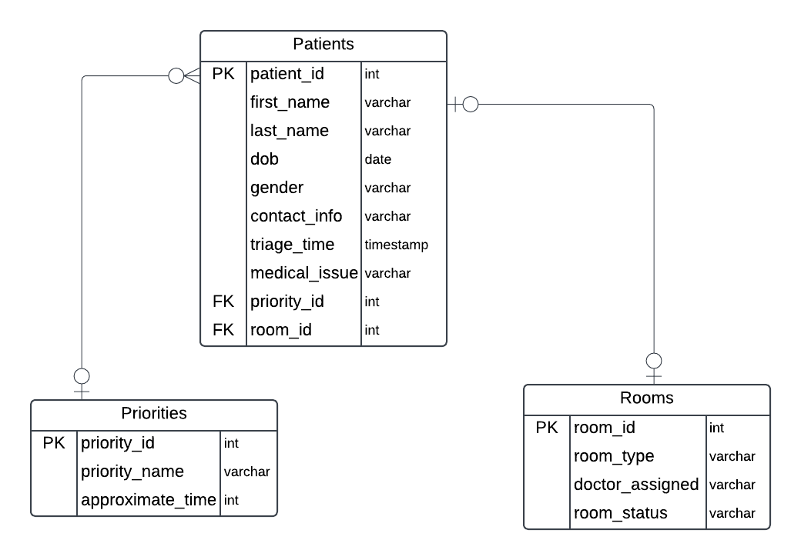

# Hospital Triage Database Design Documentation

## 1. Entities Description

### **Patients**
The `Patients` entity stores relevant data about individuals seeking medical attention. It includes personal details, medical issue descriptions, and triage information.

- **Attributes**:
  - `patient_id` (INTEGER, PRIMARY KEY): Unique identifier for each patient.
  - `first_name` (VARCHAR): The first name of the patient.
  - `last_name` (VARCHAR): The last name of the patient.
  - `dob` (DATE): The birthdate of the patient.
  - `gender` (CHAR(1)): The gender of the patient (e.g., M/F).
  - `contact_info` (VARCHAR): Contact details for the patient.
  - `triage_time` (TIMESTAMP): The time when the patient was triaged.
  - `medical_issue` (VARCHAR): A description of the patient's medical issue.
  - `priority_id` (INTEGER, FOREIGN KEY): References the `Priorities` entity, indicating the urgency of the patient's condition.
  - `room_id` (INTEGER, FOREIGN KEY): References the `Rooms` entity, indicating the room assigned to the patient.

### **Priorities**
The `Priorities` entity categorizes the urgency of patients' conditions, helping prioritize care and manage the flow of the triage process.

- **Attributes**:
  - `priority_id` (INTEGER, PRIMARY KEY): Unique identifier for the priority level.
  - `priority_name` (VARCHAR): The name of the priority level (e.g., High, Medium, Low).
  - `approximate_time` (INTEGER): The estimated waiting time (in minutes) associated with each priority level.

### **Rooms**
The `Rooms` entity stores information about the available rooms in the hospital for patient care.

- **Attributes**:
  - `room_id` (INTEGER, PRIMARY KEY): Unique identifier for each room.
  - `room_type` (VARCHAR): The type of room (e.g., ICU, General).
  - `doctor_assigned` (VARCHAR): The name of the doctor assigned to the room.
  - `room_status` (VARCHAR): The status of the room (e.g., Available, Occupied).

##  **Database ERD (Entity-Relationship Diagram)**

## 2. Relationships

The `Patients` entity is connected to the `Priorities` and `Rooms` entities through foreign keys. The `priority_id` in the `Patients` table references the `Priorities` entity, indicating the urgency of a patient's condition. The `room_id` in the `Patients` table references the `Rooms` entity, indicating the room assigned to the patient. These foreign keys create a relationship between a patient's urgency level and their room assignment.

